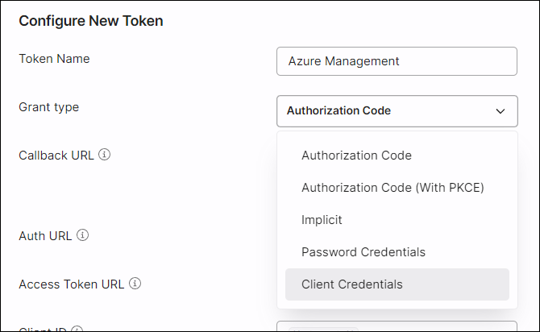

# Solving Identity Management in Modern Applications


<details>
<summary>Book Resources</summary>

- [OAuth 2.0 Authorization Framework](https://datatracker.ietf.org/doc/html/rfc6749)
- [OAuth 2.1 Authorization Framework](https://datatracker.ietf.org/doc/html/draft-ietf-oauth-v2-1-06#name-introduction-2)
- 
  
</details>

<!-- omit in toc -->
## Contents

- [1. The Hydra of Modern Identity](#1-the-hydra-of-modern-identity)
  - [Identity Challenges](#identity-challenges)
- [2. The Life of an Identity](#2-the-life-of-an-identity)
  - [Events in the Life of an Identity](#events-in-the-life-of-an-identity)
  - [3. Evolution of Identity](#3-evolution-of-identity)
    - [Identity Management Approaches](#identity-management-approaches)
      - [Per-Application Identity Silo](#per-application-identity-silo)
      - [Centralized User Repository](#centralized-user-repository)
      - [Early SSO Servers](#early-sso-servers)
      - [Federated Identity and SAML 2](#federated-identity-and-saml-2)
      - [WS-Fed](#ws-fed)
      - [OpenID](#openid)
      - [OAuth 2](#oauth-2)
      - [OpenID Connect (OIDC)](#openid-connect-oidc)
      - [OAuth 2.1](#oauth-21)
- [4. Identity Provisioning](#4-identity-provisioning)
  - [Provisioning Options](#provisioning-options)
    - [Self-Registration](#self-registration)
      - [Progressive Profiling](#progressive-profiling)
      - [Invite-Only Registration](#invite-only-registration)
    - [Identity Migration](#identity-migration)
      - [Support Legacy Hashing Algorithm](#support-legacy-hashing-algorithm)
      - [Bulk Identity Migration](#bulk-identity-migration)
      - [Gradual Migration of Users](#gradual-migration-of-users)
    - [Administrative Account Creation](#administrative-account-creation)
      - [Cross-Domain Account Creation](#cross-domain-account-creation)
    - [Leveraging Existing Identity Service](#leveraging-existing-identity-service)
  - [Selecting an Identity Service](#selecting-an-identity-service)
    - [Self-Registered Identities](#self-registered-identities)
    - [Organization Identities](#organization-identities)
    - [Government Identities](#government-identities)
  - [Identity Provider Selection](#identity-provider-selection)
  - [Identity Proofing](#identity-proofing)
  - [Choosing and Validating Identity Attributes](#choosing-and-validating-identity-attributes)
- [5. OAuth 2 and API Authorization](#5-oauth-2-and-api-authorization)
  - [API Authorization](#api-authorization)
  - [OAuth 2](#oauth-2-1)
  - [Terminology](#terminology)
    - [Roles](#roles)
    - [Confidential and Public Clients](#confidential-and-public-clients)
    - [Client Profiles](#client-profiles)
    - [Tokens and Authorization Code](#tokens-and-authorization-code)
  - [How OAuth 2 Works](#how-oauth-2-works)
    - [Authorization Code Grant](#authorization-code-grant)
      - [Authorization Code Grant Type + PKCE](#authorization-code-grant-type--pkce)
    - [Client Credentials Grant](#client-credentials-grant)
      - [The Authorization Request](#the-authorization-request-1)
    - [Implicit Grant (Removed in OAuth 2.1)](#implicit-grant-removed-in-oauth-21)
      - [Implicit Grant Type Risks](#implicit-grant-type-risks)
    - [Resource Owner Password Credentials Grant (Removed in OAuth 2.1)](#resource-owner-password-credentials-grant-removed-in-oauth-21)
      - [Resource Owner Password Credentials Grant Type Risks](#resource-owner-password-credentials-grant-type-risks)
    - [Device Authorization Grant](#device-authorization-grant)
      - [Device Authorization Grant Requirements](#device-authorization-grant-requirements)
      - [The Authorization Request](#the-authorization-request-2)
      - [Authorization Response](#authorization-response)
      - [Polling the Authorization Server](#polling-the-authorization-server)
    - [Calling an API](#calling-an-api)
    - [Refresh Tokens](#refresh-tokens)
  - [Token Usage Guidance](#token-usage-guidance)
    - [Access Tokens](#access-tokens)
    - [Refresh Tokens](#refresh-tokens-1)
    - [Confidentiality and Integrity](#confidentiality-and-integrity)
    - [Token Revocation](#token-revocation)
- [6. OpenID Connect](#6-openid-connect)
  - [Problem to Solve](#problem-to-solve)
  - [Terminology](#terminology-1)
    - [Roles](#roles-1)
    - [Client Types](#client-types)
    - [Tokens and Authoriztion Code](#tokens-and-authoriztion-code)
    - [Endpoints](#endpoints)
    - [ID Token](#id-token)
  - [How OIDC Works](#how-oidc-works)
    - [OIDC Flows](#oidc-flows)
    - [OIDC Authorization Code Flow](#oidc-authorization-code-flow)
      - [Authentication Request](#authentication-request)
      - [Authentication Response](#authentication-response)
      - [Token Request](#token-request)


## 1. The Hydra of Modern Identity

> Wisdom is not a product of schooling but of the lifelong attempt to acquire it. &mdash; Albert Einstein

Over time, teams maintaining an in-house identity service start to feel like they are fighting a hydra &mdash; the mythical beast from Greek mythology with nine heads. When one of her heads was cut off, two more would grow back in its place. The more you try to fix the problem, the worse it gets.

### Identity Challenges

There isn't a master solution to identity management that fits every case. 

Decisions when developing applications:
- Who are your users? And will they authenticate?
- Level of authentication strength?
- How do you provide simple but secure access?  SSO provides convenience, but can also be a single point of failure.
- Will you be migrating from legacy applications?
- Regulatory requirements?
- User experience when onboarding?

This book covers three popular identity protocols: OAuth 2, OIDC (OpenID Connect), and SAML 2.

## 2. The Life of an Identity

**Terminology:**  
- Identifier: refers to a single attribute whose purpose is to uniquely identify a person or entity, within a specific context.
- Identity: a collection of attributes associated with a specific person or entity in a specific context.

An identity includes one or more identifiers, e.g. name, age, address, IP address, model, version number.

A person may have more than one identity, e.g. a person may have a work identity and a personal identity.

An account is a local construct that is used to perform actions on an identity associated with specific context.

An identity management (idM) system is a set of services that support the creation, modification, and removal of identities and associated accounts, including the authentication and authorization required to access resources.

### Events in the Life of an Identity

The chapters in this book will cover the following events in the life of an identity:


### 3. Evolution of Identity

#### Identity Management Approaches

##### Per-Application Identity Silo

Each application implements its own identity repository, authentication, authorization, and access control. This approach is still used in many scenarios where a user signs up for an application-specific username and password.

##### Centralized User Repository

Includes directory services. Enables applications hosted around the world to leverage the same identity information.

Disadvantages:
- Directory does not maintain user session state.
- Each application still had to collect the username and password, exposing the user's password to each application.
- A compromise at one application might put other applications at risk.

##### Early SSO Servers

Early SSO servers leveraged the directory service but provided a layer on top of it to maintain sessions to remember users that had already authenticated.

An application would redirect the user to an SSO server to have the user authenticated there, and the application would receive the authentication results in a secure predetermined fashion.

If a user accessed a second application shortly after they authenticated for the first application, the SSO server would recognize that the user had already authenticated and would not require them to log in again.

Benefits:
- Users were able to log in once and access multiple applications.
- User's password was only sent to one place, the SSO server.
- Single place to implemnt authentication policy and stronger authentication mechanisms.

Drawbacks:
- The interaction between applications and SSO servers was somewhat proprietary, leading to vendor lock-in.
- SSO products were time-consuming to implement and maintain.
- SSO relied on cookies, which due to browser restrictions, meant the solutions worked within one Internet domain.

##### Federated Identity and SAML 2

The explosion of SaaS applications created challenges for managing identities, as users were able to sign up for an account without the IT department's knowledge. 

The SAML 2 (Security Assertion Markup Language) standard, published in 2005, provided a solution for web single sign-on (SSO) across domains and federated identity. 

With SAML 2, SaaS applications could redirect corporate users back to a corporate authentication service, known as an identity provider (IdP), for authentication.

Identity federation provided a way to link an identity used in an application with an identity at the service provider.

Companies could now have the advantages of single sign-on with both internal and SaaS applications.

However, SAML 2 was no silver bullet. 
- It was complex to configure and implement.
- There was no viable business model to address consumer-facing scenarios, as users were unlikely to pay money for a consumer-facing identity service.
- It only solved the authentication problem, not the authorization problem.

At the time, applications were evolving to architectures based on REST APIs, and SAML 2 was not well suited for this.

##### WS-Fed

The Web Services Federation Language (WS-Fed) was created as part of a larger set of protocols known as WS-* specifications.

The WS-Fed 1.2 specification, published in 2009, provided mechanisms to authorize access to managed resources for identities managed in other realms.

Intially, ADFS only supported WS-Fed. ADFS introduced SAML 2 support in version 2.0, released in 2010.

##### OpenID

With SAML 2 only adopted in employee-facing scenarios, consumers were still forced to register for accounts with each application they used.

A new industry group gave rise to a protocol called OpenID, which included the idea of a user-controlled identity solution for the consumer use case.

The original OpenID protocol was never widely used, but it did highlight the need for user-centric identity solutions and laid the groundwork for OpenID Connect (OIDC).

##### OAuth 2

With the rise of social media, many consumer-facing websites were created that allowed users to upload content such as pictures.

This gave rise to use cases where applications needed to retrieve content on the user's behalf. For example, a person who uploaded photos to a social media site might want to enable another website that printed photos to access their photos at the social media site.

In the absence of a better solution, the user would have to provide their username and password to the photo printing site, which would then use that information to access the social media site.

The OAuth 2 protocol addressed this by allowing a user to authorize a third-party application to access their resources without sharing their credentials.

The OAuth 2 version allows a user to authorize one application, known as a client (the photo printing site), to send a request to an API, known as a resource server (the social media site), on the user's behalf to retrieve data at the resource server owned by the user.

To accommodate this, the application interacts with an authorization server which authenticates a user as part of obtaining their consent for the application to access their resources.

The application receives a token, whcih enables it to call the reosurce server on the user's behalf.

By this time, Google and LinkedIn implemented OAuth 2, enabling consumer-facing applications to use OAuth 2 to access user data at these sites.

There was one problem, though...

OAuth 2 was not designed as a general authentication service and could not securely be used for this purpose, so another solution was needed.

##### OpenID Connect (OIDC)

OpenID Connect (OIDC) was designed to provide a key feature needed for an authentication service: the ability to verify the identity of a user based on the authentication performed by an authorization server.

OIDC was devised as a layer on top of OAuth 2 to provide information in a standard format to applications about the identity of an authenticated user. This provided a solution for applications for user authentication as well as API authorization.

Benefits of OIDC:
- Website developers can delegate the work of implementing authentication and password reset logic to an OIDC provider.
- Users can leverage one account to log in to many sites without exposing their account credentials to other sites.
- Users have fewer usernames and passwords to remember, which reduces the risk of password reuse.
- Providers benefit if OIDC attracts more users to their platform.
- OIDC provides the SSO benefits of SAML 2 and when combined with OAuth 2, it provides a solution for both authentication and authorization.

##### OAuth 2.1

The OAuth 2.0 specification was published in 2012. By 2020, application developers had to read through a lot of OAuth 2-related documents to understand best practices for using OAuth 2 in different scenarios, such as browser-based applications, native mobile applications, and classic web applications.

To address this, the OAuth working group began working on a new specification, OAuth 2.1, which aims to consolidate and simplify the OAuth 2.0 framework by incorporating best practices and removing deprecated features.

## 4. Identity Provisioning

An identity includes at least one identifier, such as a username or email address, and various user profile attributes.

### Provisioning Options

Here are some common approaaches for provisioning identities:
- A user creates a new identity by filling out a self-registration form
- A special case of self-registration is sending select users an invitation to sign up
- User identities are transferred  from a previously existing user repository
- An identity service with an existing repository of user identies is leveraged
- An administrator or automated process creates identities

#### Self-Registration

Requires you to design and create a sign-up form. Form must be able to scale to handle large numbers of users. Self-registration necessitates privacy notices about the information you collect.

| **Advantages**                                                 | **Disadvantages**                                     |
| -------------------------------------------------------------- | ----------------------------------------------------- |
| Ability to collect user attributes that don’t exist elsewhere. | May deter some prospective new users from signing up. |
| Control over user registration experience.                     | Liability associated with storing login credentials.  |
| Scalability through self-service.                              |                                                       |

##### Progressive Profiling

Progressive profiling is a technique where you build up user profile attributes over time, rather than asking for all attributes at once during registration.

Progressive profiling reduces the friction that a lengthy sign-up form would present.

##### Invite-Only Registration

Used for situations where you create an account and assign it privileges before sending the invitation.

| **Advantages**                                                       | **Disadvantages**                                                        |
| -------------------------------------------------------------------- | ------------------------------------------------------------------------ |
| Ability to collect user attributes not available from other sources. | The work to implement the invitation mechanism and control access to it. |
| Control over user registration experience.                           | The work to issue invitations.                                           |
| Some protection against registration by hackers and bots.            | May deter some prospective new users from signing up.                    |
| Scalability through self-service if users invite others.             | Liability associated with storing login credentials.                     |

#### Identity Migration

While most user profile attributes can be moved, passwords represent a challenge.

Passwords are typically stored in a hashed format. Most systems use salts and iterations counts, which makes it difficult to import passwords from one system to another and have it be usable in the new system.

##### Support Legacy Hashing Algorithm

One solution is to move the hashed passwords to the new system and update the new system to support the legacy hashing algorithm. 


| **Advantages**                            | **Disadvantages**                                                |
| ----------------------------------------- | ---------------------------------------------------------------- |
| Avoids need for password reset.           | Work to implement legacy hashing algorithm(s).                   |
| Transfers all accounts in a usable state. | Liability associated with storing login credentials.             |
|                                           | Inherits any weakness associated with legacy hashing algorithms. |

##### Bulk Identity Migration

If it's not possible to support the legacy hashed passwords, you can extract the user profile attributes and create new accounts in the new system.

| **Advantages**                                                              | **Disadvantages**                                                                                                                                  |
| --------------------------------------------------------------------------- | -------------------------------------------------------------------------------------------------------------------------------------------------- |
| Transfers all users at once.                                                | Transfers all accounts, even inactive accounts, unless they are filtered out during the transfer.                                                  |
| Enables immediate shutdown of legacy user repository.                       | Requires all users to set new passwords via account recovery, unless the new system supports legacy hashed passwords.                              |
| No latency added at login time to check a legacy system for a user account. | Migrating all users at once may cause an outage or delay the migration if things go wrong and there is no backup plan.                             |
| Code to transfer identities can be independent of application code.         | If multiple applications use the legacy repository, they must migrate at the same time if the legacy repository is to be shut off after migration. |
|                                                                             | Liability associated with storing login credentials.                                                                                               |

##### Gradual Migration of Users


| **Advantages**                                                                                                                                 | **Disadvantages**                                                                                                         |
| ---------------------------------------------------------------------------------------------------------------------------------------------- | ------------------------------------------------------------------------------------------------------------------------- |
| Inactive accounts can be weeded out.                                                                                                           | Requires that legacy identity store is accessible from new application’s authentication mechanism.                        |
| No password reset required (for users who log in during migration).                                                                            | Legacy identity store must remain accessible until enough identities are transferred.                                     |
| Spreads out risk of outages by migrating identities gradually (no big bang risk).                                                              | Transfer mechanism must be maintained throughout the gradual migration.                                                   |
| Can support continued use of previous sign-up mechanisms or applications that use the legacy identity repository during the gradual migration. | A user’s first login after migration starts may have some latency as identity data is transferred from the legacy system. |
|                                                                                                                                                | Potential for user confusion after password reset if other applications continue to use the legacy data store.            |
|                                                                                                                                                | Potential for user confusion if users can make user profile updates in both legacy and new systems after migration.       |
|                                                                                                                                                | Implementation work cannot be easily decoupled from the application team.                                                 |
|                                                                                                                                                | Liability associated with storing login credentials.                                                                      |


#### Administrative Account Creation

The approaches include:
- Manual account creation
- Automated account creation
- Cross-domain acocunt creation

##### Cross-Domain Account Creation

Applicable sceanarios:
- Maintaining employee accounts in external SaaS applications
- Maintaining partner accounts in corporate identity repositories or applications
- Maintaining business customer user accounts in business-facing applications
- Maintaining guest professor or student accounts in educational institutions
- Maintaining guest user accounts in public sector applications

The industry-standard protocol, SCIM 2.0 (System for Cross-domain Identity Management), can be used to facilitate cross-domain account creation and management.

SCIM 2.0 was defined in 2015 to provide a more standard approach to sending an5updating identify information from one domain to another.

SCIM 2.0 is a RESTful API that uses JSON to represent user profile attributes and supports the creation, modification, and deletion of user accounts.

SCIM also provides an optional common user schema, though mapping profile attributes between systems is usually required.


| **Advantages**                                                                                        | **Disadvantages**                                                                      |
| ----------------------------------------------------------------------------------------------------- | -------------------------------------------------------------------------------------- |
| User doesn’t fill out registration form.                                                              | Time-consuming if not automated.                                                       |
| Administrator can assign customized privileges for the account.                                       | Requires care to ensure that only the user knows the password for the account created. |
| Can incorporate manual identity validation step if required by the organization creating the account. | Liability associated with storing login credentials if stored locally.                 |
| Can be automated via workflow or identity provisioning software.                                      |                                                                                        |
#### Leveraging Existing Identity Service

Popular with social providers. Involves less work for users.

It is important to vet an external identity service before trusting it.

| **Advantages**                                                                                                                        | **Disadvantages**                                                                                                                                |
| ------------------------------------------------------------------------------------------------------------------------------------- | ------------------------------------------------------------------------------------------------------------------------------------------------ |
| Better user experience if it reduces the data required to sign up.                                                                    | You may have to collect additional profile information not available from the identity provider service.                                         |
| Easier for user to remember password if identity provider account is used frequently.                                                 | You need to evaluate the service and availability levels of the external identity service to ensure it meets your needs.                         |
| You may not have to implement a login form or account recovery mechanism if all users authenticate via the identity provider service. | May require additional development or configuration work for each identity provider service to be used.                                          |
| Less risk if you do not store user passwords.                                                                                         | May require configuration work at each identity provider service for each application you have, unless you use an authentication broker service. |
|                                                                                                                                       | May require collaborative troubleshooting with another organization when issues occur.                                                           |

### Selecting an Identity Service

Characteristics of strong vs weak identities:

| **Strong Identities**                                                                                             | **Weak Identities**                                   |
| ----------------------------------------------------------------------------------------------------------------- | ----------------------------------------------------- |
| Linked to a real person, who can be held accountable for actions taken with the identity and associated accounts. | Anonymous, cannot be linked to a real person.         |
| Identity attributes are validated during account issuance process.                                                | Little validation of identity attributes.             |
| Issued by entity recognized as authoritative for a particular context.                                            | Issued by an entity with little recognized authority. |
| Contains mechanisms to protect against forgery or unauthorized use.                                               | Few protections against forgery or unauthorized use.  |

#### Self-Registered Identities

A self-registered identity, such as Gmail, is an example of a weak identity. You can sign up for these accounts using any identifier that is not already taken, e.g. santa.claus@yahoo.com.

You do not have to supply true information in the sign-up form, and the service provider does not validate most of the identity data.

#### Organization Identities

Many of these identities meet the criteria for strong identities, as they are issued by an organization that is recognized as authoritative in a particular context.

#### Government Identities

Are an example of strong identities, as they are issued by a government entity that is recognized as authoritative in a particular context.

### Identity Provider Selection

There are many vendors that offer cloud-based identity services, such as Google Apps, Azure AD, Auth0, Amazon Cognito, Okta, and Ping Identity.

Identity provider scenarios:

| **Scenario**                  | **Common Type(s) of Identity Provider**                                                                                             |
| ----------------------------- | ----------------------------------------------------------------------------------------------------------------------------------- |
| **B2C: Business to consumer** | Social Identity Providers<br>Identity services such as Azure AD or Auth0<br>Application-specific repository                         |
| **B2E: Business to employee** | Identity services such as Google Apps, Azure AD, Auth0<br>Any OIDC or SAML 2–compliant identity provider                            |
| **B2B: Business to business** | Identity services such as Google Apps, Azure AD, Auth0<br>Any OIDC or SAML 2–compliant provider controlled by the business customer |

### Identity Proofing

In the US, the Patriot Act requires that financial institutions verify the identity of their customers before opening an account. This is known as identity proofing.

Providers, such as ID.me, Sumsub, Socure, and Trulioo, are examples of venddors that help validate identities of self-registered users.

### Choosing and Validating Identity Attributes

Advantages and disadvantages of account identifiers


| **Advantages**                                                                                                                                                                                                                     | **Disadvantages**                                                                                                                                                                                                                                                                                                                                                                                                                                             |
| ---------------------------------------------------------------------------------------------------------------------------------------------------------------------------------------------------------------------------------- | ------------------------------------------------------------------------------------------------------------------------------------------------------------------------------------------------------------------------------------------------------------------------------------------------------------------------------------------------------------------------------------------------------------------------------------------------------------- |
| **Email:** Globally unique.<br>No need to hunt for a name that isn’t taken already.<br>May be easier to remember than a username.<br>Can double as a communication attribute, such as for password resets.                         | **Email:** May need to be changed by a user.<br>May be reassigned by an email provider to a new user.<br>May be reassigned by a corporate provider to a new user.<br>Terminated by the employer if a user leaves.<br>Not all companies issue email addresses.<br>Children may not have email addresses.<br>Family members may share an email address.<br>May expose personal information (user's name).<br>Exposure as display name may result in spam email. |
| **Username:** Easier to set up multiple accounts at a site.<br>May be shorter to type on mobile devices.<br>Can be used in searches, allowing other attributes with personal data to be encrypted.                                 | **Username:** Only unique within an application domain.<br>Merging user repositories problematic after acquisitions.<br>May be harder for a user to remember which username was used at each site.<br>A user may want to change a username over time.<br>May expose personal information if used for display and it contains personal information.                                                                                                            |
| **Phone number:** Globally unique (with country code).<br>No need to hunt for a free identifier.<br>Can double as a communication attribute, such as for password resets.<br>May be easier for a user to remember than a username. | **Phone number:** Exposure as display name may cause spam calls.<br>Might be reassigned to a new user over time.<br>May involve a charge to obtain a phone number.<br>More difficult for a person to set up multiple accounts at the same site.<br>May be changed by a user for various reasons.<br>May be terminated by a phone provider.                                                                                                                    |

## 5. OAuth 2 and API Authorization

### API Authorization

An application may need to call an API on behalf of a user to access content owned by the user. Or it may call the API on its own behalf if teh application owns the desired content.


### OAuth 2

OAuth stands for "Open Authorization". The protocol was designed as an open standard, hence the "O".

With OAuth 2, an application can obtain a user's consent to call an API on their behalf, without needing the user's credentials for the API site. An application cals also obtain authorization to call an API on its own behalf if it owns the content to be accessed.

Prior to OAuth 2, the application needed the user's credentials to act on behalf of the user, putting the user's credentials at risk:


With OAuth 2, an authorization server handles access requests for an API and returns a security token that can be used by the application to access the API.


### Terminology

#### Roles

OAuth defines four roles in an authoriztion request:

1. Resource Server &mdash; A service (with an API) storing protected resources to be accessed by an application.
2. Resource Owner &mdash; A user or other entity that owns protected resources at the resource server
3. Client &mdash; An application which needs to access resources at the resource server, on the resource owner's behalf or on its own behalf.
4. Authorization Server &mdash; A service trusted by the resource server to authorize applications to call the resource server. It authenticates the application or resource owner and requests consent. With OAuth 2, the resource server (API) is a relying party to the authorization server. The authorization server and resource server may be operated by the same entity.

#### Confidential and Public Clients

OAuth 2 defines two client types:

1. Confidential Client &mdash; An application that can secure store confidential secrets with which to authenticate itself to an authorization server. Confidential clients typically execute primarily on a protected server.
2. Public Client &mdash; An application that can neither securely store a secret or credentials to authenticate itself to an authorization server. Public clients typically execute on the user's client device or in the client browser.

#### Client Profiles

OAuth 2 defines three profiles for client applications based on application topologies:

1. Web Application &mdash; A confidential client with code executing on a protected, back-end server. The server can securely store any secrets needed for the client to authenticate itself as well as any tokens it receives from the authorization server. Such credentials are not exposed to the resource owner.

2. Browser-Based Application &mdash; Assumed to be a public client with code executing in the user's browser. Examples: A JavaScript-based single-page application (SPA) running in the browser. Such an application is assumed to be incapable of adequately securing credentials with which to authenticate itself to the authorization server.

3. Native Application &mdash; Assumed to be a public client that is installed and executed on the user's device, such as a mobile appliction or desktop application.

In practice, these definitions may overlap because a web application may serve up HTML pages that contain some JavaScript, and single-page applications may have a small back end.

#### Tokens and Authorization Code

OAuth 2 defines two security tokens and an intermediate authorization code:

1. Authorization Code &mdash; An intermediary, opaque code returned to an application to obtain an access token and optionally a refresh token. Each authorization code is used once.

2. Access Token &mdash; A token used by an application to access an API. It represents the application's authorization to call an API and has an expiration.

3. Refresh Token &mdash; An optional token that can be used by an application to request a new access token when a prior access token has expired.

### How OAuth 2 Works

The OAuth 2 Authorization Framework defines different methods by which an application interacts with an authorization server to obtain authorization to call an API. Each method uses a credential, known as authorization grants, to obtain an access token.

There are three main types of authorization grants:
- Authorization code
- Client credentials
- Refresh token

There were two additional grant types that were removed in OAuth 2.1:
- Implicit grant
- Resource owner password credentidals
 
An additional grant type has been designed for devices which have limited capabilities for user interaction, i.e. scenarios for IoT; however, this grant type has not made it into the specification yet:
- Client device

Screenshot from Postman showing OAuth 2.0 authorization grants:




#### Authorization Code Grant

The authorization code grant uses two requests from the application to the authorization server to obtain an access token.

The reason for using two separate requests is so the access token is never exposed in the browser or front-channel, reducing the risk of interception. By exchanging a short-lived code for the token over a secure back-channel, the server can authenticate the client and validate the request before issuing the token.

First, the user's browser is redirected to the authorization server’s endpoint to approve an API call on their behalf. This redirect lets the server authenticate the user and get their consent. Once consent is given, the server sends the browser back to the application with an **authorization code**.

Next, the application uses the authorization code to make a back-channel request to the authorization server’s token endpoint. The server then issues an access token, which the application can use to call the API.


The authorization code grant type was designed for confidential clients. It allows a secure application backend, which can safely store an authentication secret, to verify its identity with the authorization server when exchanging an authorization code for an access token.

It also means the response with the access token can be delivered to the application back end, which will make subsequent API calls. 

A side benefit is that tokens are returned via secure back-channel response. However, while originally optimized for confidential clients, the addition of PKCE enables other client types to use this grant type as well.

##### Authorization Code Grant Type + PKCE

PKCE (Proof Key for Code Exchange), pronounced "pixie", is an extension to the authorization code grant type that enables public clients to use it securely.

PKCE does not authenticate clients; rather, it ensures the application that requested an authorization code is the same application that uses the authorization code to obtain an access token.

PKCE was defined after OAuth 2.0 was published, so it is not part of the original OAuth 2.0 specification. It was added to the OAuth 2.1 specification.


###### How PKCE Works

With PKCE, the app first generates a cryptographically random string called the **code verifier**. This string is long enough to make guessing impractical.

The app then creates a **code challenge** from the verifier, usually by hashing it. The challenge should be one-way, so the verifier can’t be recovered quickly enough to compromise security.

When sending the authorization request (step 2 in the diagram above), the app includes both the code challenge and the method used to generate it.

In step 6, when the app sends the authorization code to the token endpoint, it also sends the code verifier.

The authorization server applies the same transformation method specified in the original authorization request and compares the result to the code challenge from step 2.

This check ensures that only the app with the correct code verifier can use the authorization code, blocking malicious apps from using a stolen code.

###### Code Challenge Methods 
The PKCE spec defines two ways to create a code challenge from a code verifier: “plain” and “S256.”

With “plain,” the challenge is the same as the verifier, offering no extra protection if the challenge is exposed.

“S256” is preferred—it creates a base64 URL-encoded SHA256 hash of the verifier, making it much harder to reverse.

###### The Authorization Request

Here is an example of an authorization request using the authorization code grant type with PKCE:

```
GET /authorize?
response_type=code 
& client_id=<client_id> 
& state=<state> 
& scope=<scope> 
& redirect_uri=<callback uri> 
& resource=<API identifier> 
& code_challenge=<PKCE code_challenge>            # Sends the code challenge (and method) in the first request
& code_challenge_method=S256 HTTP/1.1 
Host: authorizationserver.com
```

| **Parameter**               | **Meaning**                                                                                                                                                              |
| --------------------------- | ------------------------------------------------------------------------------------------------------------------------------------------------------------------------ |
| **response\_type**          | OAuth 2 grant type. Use “code” for authorization code grants.                                                                                                            |
| **client\_id**              | App ID assigned by the authorization server during registration.                                                                                                         |
| **state**                   | Unique, hard-to-guess value to link requests and responses, helping prevent CSRF. Ties the request to the user’s session. Must not contain sensitive data in plain text. |
| **scope**                   | Requested access permissions, e.g., “get\:documents.” Must not contain sensitive data in plain text.                                                                     |
| **redirect\_uri**           | Callback URL for the authorization server’s response. Must exactly match the registered URI (except port numbers for localhost in native apps).                          |
| **resource**                | API identifier for the requested access token. Needed only if multiple APIs are possible. Sometimes called “audience.”                                                   |
| **code\_challenge**         | PKCE code challenge derived from the code verifier using the method in code\_challenge\_method.                                                                          |
| **code\_challenge\_method** | “S256” or “plain.” Use “S256” when possible.                                                                                                                             |

###### Response to Authorization Request

The authorization server responds with a redirect to the application’s callback URL, including the authorization code and state:

```
HTTP/1.1 302 Found 
Location: https://clientapplication.com/callback? 
code=<authorization code> 
& state=<state>
```
| **Parameter** | **Meaning**                                                                                                         |
| ------------- | ------------------------------------------------------------------------------------------------------------------- |
| **code**      | Authorization code used by the app to request an access token.                                                      |
| **state**     | Unchanged value from the authorization request. Must match the value sent with the initial request to prevent CSRF. |

###### Calling the Token Endpoint

After receiving the authorization code, the application uses it in a second request to the authorization server’s token endpoint to obtain an access token.

```
POST /token HTTP/1.1
Host: authorizationserver.com
Authorization: Basic <encoded application credentials> 

Content-Type: application/x-www-form-urlencoded 
grant_type=authorization_code 
& code=<authorization_code> 
& client_id=<client id>
& code_verifier=<code verifier>             # Sends the code verifier to prove it is the same application that requested the authorization code   
& redirect_uri=<callback URI>
```
| **Parameter**      | **Meaning**                                                                                                                                                         |
| ------------------ | ------------------------------------------------------------------------------------------------------------------------------------------------------------------- |
| **grant\_type**    | Must be “authorization\_code” for the authorization code grant.                                                                                                     |
| **code**           | Authorization code returned from the authorization call.                                                                                                            |
| **client\_id**     | App ID assigned during registration with the authorization server.                                                                                                  |
| **code\_verifier** | PKCE code verifier used to create the code challenge. Must be a cryptographically random string of 43–128 allowed characters (A–Z, a–z, 0–9, "-", ".", "\_", "\~"). |
| **redirect\_uri**  | Callback URI for the authorization server’s response. Must match the one used in the authorization request.                                                         |


###### Response to Token Request

The authorization server responds with an access token, and optionally a refresh token, in JSON format:

```
HTTP/1.1 200 OK 
Content-Type: application/json;charset=UTF-8 
Cache-Control: no-store 
Pragma: no-cache 
  { 
    "access_token":"<access_token_for_API>", 
    "token_type":"Bearer", 
    "expires_in":<token expiration>, 
    "refresh_token":"<refresh_token>" 
  }
```
| **Parameter**      | **Meaning**                                                                                     |
| ------------------ | ----------------------------------------------------------------------------------------------- |
| **access\_token**  | Token used to call the API. Format varies by authorization server.                              |
| **token\_type**    | Type of token issued, e.g., “Bearer.”                                                           |
| **expires\_in**    | Token lifetime in seconds.                                                                      |
| **refresh\_token** | Optional token to obtain a new access token. Returned at the authorization server’s discretion. |

Access tokens come in different types. Some authorization servers issue opaque tokens—encoded strings with no visible data. When a resource server receives an opaque token, it can use the token introspection endpoint of the authorization server to get details. This includes the client that requested it, the intended audience, expiration time, revocation status, and authorized scopes. The OAuth 2.0 Token Introspection specification defines this process.

Another common type is the JSON Web Token (JWT). This is a structured, cryptographically signed token that contains claims, such as the requesting client, intended audience, expiration, and scopes. Since JWTs are self-contained, a resource server can read the claims directly without contacting the authorization server. The JWT Profile for OAuth 2.0 Access Tokens defines the required and optional claims for this format.

Authorization server documentation should specify which token type it issues and how a resource server should validate and read the claims.

#### Client Credentials Grant

The client credentials grant type is used when an application calls an API to access resources the application owns, rather than resources owned by a user. It does not involve user interaction or consent.

The use of this grant type requires the application have the ability to maintain confidential secrets (or use another secure mechanism) to authenticate itself to the authorization server.


The application sends its **client credentials** to the authorization server’s `/token` endpoint, which validates them and returns an **access token**.

The application then uses the token to call the resource server’s API endpoint.

When the token expires, the application repeats the process to obtain a new one before making further API calls.

##### The Authorization Request

A sample token request for the client credentials grant type is shown below. The parameters are the same as in the previous grant type, except `grant_type` is set to `client_credentials`. In this example, the application authenticates using a client ID and secret registered with the authorization server—one of several possible authentication methods.

```
POST /token 
HTTP/1.1 Host: authorizationserver.com 
Authorization: Basic <encoded application credentials> 
Content-Type: application/x-www-form-urlencoded 
grant_type=client_credentials 
& scope=<scope> 
& resource=<API identifier>
```
A successful client credentials grant request returns an access token from the token endpoint, similar to the authorization code grant example in the previous section.

#### Implicit Grant (Removed in OAuth 2.1)

OAuth 2.0 introduced the implicit grant type, designed for public clients like single-page applications. 

It’s called **Implicit** because the access token is issued *implicitly* as part of the authorization response, without the explicit, separate step of exchanging an authorization code for a token.

In other words, instead of the application explicitly requesting a token in a second back-channel request (as in the Authorization Code flow), the token is delivered directly in the redirect response — which is faster, but less secure since it exposes the token to the browser and potentially to malicious scripts.

It delivered the access token to the application in a single step. Since CORS (Cross-Origin Resource Sharing) was not widely supported at the time, web pages were restricted to making requests only to their own domain and couldn’t call an authorization server’s token endpoint directly. To bypass this limitation, the authorization server included the token in the URL hash fragment of a redirect back to the application.


In the OAuth 2.0 Implicit Grant flow, the browser is redirected to the authorization server’s `/authorize` endpoint, where the user logs in and grants access. 

The authorization server responds by immediately returning an access token in the URL fragment, skipping the separate code exchange step used in the authorization code grant type.

The browser passes the token to the application via its callback URL. 

The application can then use this access token to call the resource server on behalf of the user. This flow was removed in OAuth 2.1 due to security concerns.

##### Implicit Grant Type Risks

Since the original OAuth 2.0 spec, most browsers have added CORS support. This makes the implicit grant type unnecessary for its original purpose. Returning an access token in a URL hash fragment also risks exposing it through browser history or referer headers. Because of this, OAuth 2.1 removes the implicit grant type. Use the authorization code grant with PKCE instead.

New applications should not use the implicit grant type. Some authorization servers may keep supporting it for a while, but due to its security risks, existing applications should switch to the authorization code grant with PKCE. This reduces the chance of token leaks, prevents a rushed upgrade if support ends suddenly, and stays aligned with OAuth 2.1.

#### Resource Owner Password Credentials Grant (Removed in OAuth 2.1)

In the OAuth 2.0 resource owner password credentials grant type, the application directly collected the user’s credentials instead of redirecting them to the authorization server. 

It then sent those credentials to the server for validation as part of the access token request. This method was meant for cases where the application was trusted to handle user credentials and no other grant type was feasible.


In the Resource Owner Password Credentials (ROPC) grant flow, the user provides their username and password directly to the application. 

The application sends these credentials to the authorization server’s `/token` endpoint to request an access token. 

The authorization server validates the credentials and responds with an access token (and optionally a refresh token). 

The application then uses the access token to access the resource server on behalf of the user. 

This flow was removed in OAuth 2.1 due to the high security risk of exposing user credentials to the application.


##### Resource Owner Password Credentials Grant Type Risks

The resource owner password credentials grant was discouraged for several reasons.

It exposed user credentials directly to the application. If the application was compromised, those credentials could be stolen. It also lacked a standard way to support multi-factor authentication, so apps often implemented it in custom ways that might not have been properly reviewed for security. In addition, there was no user consent step, meaning the app could request any access it wanted with the user’s credentials, leaving the user powerless to prevent abuse.

This grant type was used in mobile apps, embedded login pages, and user migration scenarios. Early mobile apps used it to call first-party APIs because browser-based redirects were considered inconvenient at the time. This has since improved, and OAuth 2.1 now recommends the authorization code grant with PKCE for native apps, following RFC 8252. Embedded login fields inside app pages were also common to match corporate UI standards or avoid browser redirects.

In user migration, it allowed credentials from an old system to be validated and transferred to a new one without forcing password resets. However, if the old system’s passwords were compromised, those vulnerabilities could carry over unless additional checks were applied.

Security guidance advised discarding credentials immediately after exchanging them for an access token, but this only addressed part of the risk. Because significant risks remain, OAuth 2.1 has removed support for this grant type.

New applications should use the authorization code grant with PKCE instead. Existing apps should migrate as soon as possible to avoid security issues and prepare for the possibility that authorization servers will stop supporting this method. Legacy apps that cannot upgrade will retain full responsibility for ensuring security and may face a forced migration if their identity provider ends support.

#### Device Authorization Grant

Since OAuth 2 was introduced, Internet-connected devices—often called the Internet of Things (IoT)—have become common. Like applications, IoT devices can use APIs to expand their capabilities.

For example, instead of manually uploading photos to a digital picture frame, you could let it automatically pull images from a social media account. To do this, you would authenticate with the social media site and give the frame permission to access your photos.

The OAuth 2 authorization code grant requires user interaction on the client device, but many IoT devices have limited input and display options. While it’s possible to add features like a touchscreen and browser to handle the process, that would increase cost and complexity, which may not be practical.

The OAuth 2.0 Device Authorization Grant solves this by letting the required user interaction happen on another device. The IoT device triggers an API request, such as retrieving photos or turning on a TV. It sends an authorization request to the authorization server, which returns a URL and code. These are shown to the user on the IoT device.

The user then goes to the URL on a secondary device, like a phone, enters the code, signs in, and grants permission. Meanwhile, the IoT device polls the authorization server. Once the user finishes, the next polling attempt returns an access token (and possibly a refresh token). The IoT device can then use the token to make API calls on the user’s behalf.


In the Device Authorization Grant flow, the primary client device requests a device and user code from the authorization server using its client ID. 

The device displays the verification URI and user code to the user, who enters them on a secondary device with a browser. 

The secondary device authenticates the user and grants authorization. 

The primary device polls the authorization server until the user completes verification, at which point it receives an access token (and optionally a refresh token). 

The device can then use the access token to call the resource server’s API.

##### Device Authorization Grant Requirements

For the Device Authorization Grant to work, several conditions must be met.

The primary device must be online and able to send outbound HTTPS requests to the authorization server for the target API. It must also be able to show or communicate the user verification URI, an end-user code, and instructions.

Additionally, the user needs a secondary device that can handle the interaction required to authenticate and authorize the API requests.

##### The Authorization Request

An example of a primary device’s authorization request is shown here. It would be directed via HTTP-POST to an authorization server’s device_authorization endpoint.

```
POST /device_authorization HTTP/1.1 
Host: authorizationserver.com 
Content-Type: application/x-www-form-urlencoded 
client_id=<client id>
& resource=<API identifier> 
& scope=<scope>
```
| **Parameter** | **Meaning**                                                                             |
| ------------- | --------------------------------------------------------------------------------------- |
| client\_id    | ID for the primary device, assigned during registration with the authorization server.  |
| scope         | Access privileges requested (e.g., “get\:photos”).                                      |
| resource      | ID for a specific API; sometimes called “audience.” Needed only if multiple APIs exist. |

##### Authorization Response

The authorization server replies to the primary device’s request with a device code, a user code, a verification URI, an expiration time, and a polling interval. Below is an example HTTP response containing these parameters.

```
HTTP/1.1 200 OK
Content-Type: application/json;charset=UTF-8
Cache-Control: no-store
Pragma: no-cache

{
  "device_code": "<code issued for device>",
  "user_code": "<code issued for end user>",
  "verification_uri": "https://authorizationserver.com/device",
  "expires_in": 600,
  "interval": 5
}
```
| Parameter         | Meaning                                                                |
| ----------------- | ---------------------------------------------------------------------- |
| device\_code      | Code for the primary device, used to request a token.                  |
| user\_code        | Code for the user to authorize the primary device from another device. |
| verification\_uri | URL the user visits from another device to approve the request.        |
| expires\_in       | Time in seconds before the codes expire.                               |
| interval          | Minimum wait time in seconds between polling requests.                 |

The primary device gets an authorization response containing a verification URI, device code, and user code. It shares the URI and user code with the user in a format suited to the device, such as a text link or QR code. The user is instructed to open the URI on a secondary device (e.g., smartphone) and enter the user code. The secondary device must have a browser or similar tool that supports redirects to the authorization server and allows authentication and consent.

When the user visits the URI, the authorization server asks them to log in, enter the user code, and approve the request. The exact steps may differ depending on the server. While this happens, the primary device regularly polls the authorization server for updates.

##### Polling the Authorization Server

The primary device polls the authorization server by repeatedly sending an access token request to its token endpoint. The authentication method for these requests can vary based on the server and the settings used when the device was registered. Polling frequency should follow the “interval” value provided by the server.

Example token request:

```
POST /token HTTP/1.1
Host: authorizationserver.com
Content-Type: application/x-www-form-urlencoded

grant_type=urn:ietf:params:oauth:grant-type:device_code
& device_code=<device code>
& client_id=<client id>
```
| Parameter    | Meaning                                                                |
| ------------ | ---------------------------------------------------------------------- |
| grant\_type  | Type of grant. Must be `urn:ietf:params:oauth:grant-type:device_code`. |
| device\_code | Code issued to the primary device for token requests.                  |
| client\_id   | ID assigned to the primary device during registration.                 |

The authorization server uses the client ID and device code to link a polling request to the original authorization request. The primary device should poll no more often than the interval value from the server’s response.

Polling continues while the user interacts with the authorization server. Possible responses include:

* **authorization\_pending** – User has not finished authorization.
* **slow\_down** – Reduce polling frequency.
* **access\_denied** – User rejected the request.
* **expired\_token** – Device code expired.

These are in addition to standard OAuth 2 error codes for issues like invalid requests or unauthorized access.

Once the user authorizes the request, the next poll will return an access token and possibly a refresh token. The primary device can then use the access token to make API calls for the user.

#### Calling an API

After an application gets an access token through any grant type, it can call the resource server and include the token in its request. 

OAuth 2.1 requires sending the token in the HTTP Authorization header or the request body, never in a URI query parameter.

The common method is to send it as a bearer token in the Authorization header:

```
GET /api-endpoint HTTP/1.1
Host: api-server.com
Authorization: Bearer <access_token>
```

Bearer tokens can be used by anyone who has them, so if stolen, they allow unauthorized API access. To reduce this risk, OAuth 2.1 recommends safeguards such as short-lived tokens, explained later in the “Token Usage Guidance” section.

#### Refresh Tokens

Access tokens eventually expire. While an application could request a new authorization each time, doing so with short-lived tokens would mean frequent, inconvenient consent prompts for users.

OAuth 2 offers a better option using refresh tokens. An authorization server may return a refresh token along with an access token. When the access token expires, the application can use the refresh token to get a new one without user interaction—even if the user is offline. This is especially useful for native mobile apps that need continuous API access.

OAuth 2 does not define how to request refresh tokens; each authorization server handles this differently. Some issue them automatically, while others require an explicit request. (OIDC adds a defined method for certain cases.) You’ll need to check your server’s documentation for specifics.

Example request for a new access token with a refresh token:

```
POST /token HTTP/1.1
Host: authorizationserver.com
Authorization: Basic <encoded application credentials>
Content-Type: application/x-www-form-urlencoded

grant_type=refresh_token
& refresh_token=<refresh_token>
```

The server returns an access token similar to earlier examples. The optional `scope` parameter can match or be narrower than the original scope. The client credentials must match those from the original request.

Refresh tokens are mainly for flows where the user is the resource owner. They’re unnecessary for the client credentials grant, since the app can request new access tokens directly without user involvement.

### Token Usage Guidance

#### Access Tokens

An access token is meant for use by a resource server API, not for the application to read (unless using proprietary extensions). Its format depends on the authorization server—it could be an opaque token or a JSON Web Token (JWT).

* **Opaque token:** The resource server must call the authorization server’s introspection endpoint to get token details.
* **JWT:** Self-contained, allowing the resource server to read its claims directly.

In both cases, the resource server must validate the token before using it. Validation steps vary by implementation.

Access tokens expire, and short lifetimes are recommended. Tokens should be refreshed only when needed, following the principle of least privilege, rather than constantly keeping one active. Expiration time should match the sensitivity of the resource. Tokens can be cached until they expire to improve performance and avoid rate limits.

A token must include the correct scope for the API calls it will make. Avoid broad scopes like `do:anything`; instead, request the minimum needed for the scenario (e.g., a viewer app should request `get:documents`, not edit or delete permissions). Scopes should describe coarse-grained privileges, not individual resources, to avoid administrative complexity.

Where possible, tie the token to a specific resource server using a `resource` or `audience` parameter. This prevents a token for one resource server from being used on another and reduces the risk of abuse.

#### Refresh Tokens

Refresh tokens let applications get new access tokens without user interaction, enabling short-lived access tokens that reduce the impact of theft. But refresh tokens themselves are sensitive—if stolen, they can be used to generate new access tokens. Both access and refresh tokens must be securely stored using platform-specific secure storage. For single-page applications in browsers, secure storage is limited, making long-lived refresh tokens risky, especially for public clients.

**Ways to reduce refresh token theft risk:**

* **Refresh token rotation:** Each time an access token is renewed, the server issues a new, single-use refresh token. If the same refresh token is used by two clients (legitimate and malicious), the server detects this and revokes it.
* **Sender-constrained tokens:** Bind a token to the client that requested it so it can’t be used elsewhere.

Two main sender-constrained methods:

1. **Mutual-TLS:** The client authenticates with a certificate, and the token is bound to that certificate. The client must prove possession of the matching private key when using the token.
2. **DPoP (Demonstrating Proof-of-Possession):** The client signs a JWT containing its public key when requesting a token. The server binds the token to the public key. When using the token, the client sends another signed proof to show it still holds the key.

OAuth 2.1 requires public clients to use either refresh token rotation or sender-constrained tokens to limit refresh token abuse. Adoption varies, so you should check your OAuth provider’s documentation for supported methods.

#### Confidentiality and Integrity

All OAuth 2 interactions should use a current, secure version of TLS—between the application and the authorization server, between the application and the resource server, and (if applicable) between the resource server and authorization server.

OAuth 2 requires TLS for authorization and token endpoint requests, and applications should enforce TLS for callbacks. Additional guidance is in the OAuth 2.1 Security Considerations section.

Applications must:

* Protect access and refresh tokens in secure storage.
* Validate tokens as recommended by the authorization server.
* Perform TLS certificate checks to ensure requests go to the correct resource server.
* Prevent token leakage.
* Follow secure coding practices, including protections against XSS and CSRF, where relevant.

#### Token Revocation

Applications should revoke refresh and access tokens when they’re no longer needed. OAuth 2.0 Token Revocation defines how a client can request token revocation, but support for revoking access tokens is optional—some authorization servers may not allow it. Check your OAuth provider’s documentation for details. Token revocation in the context of logout is covered in Chapter 13.


## 6. OpenID Connect

OAuth 2 is a framework for authorizing applications to access APIs, but it doesn’t handle user authentication. OpenID Connect (OIDC) builds on OAuth 2 by adding an identity layer. This allows authorization servers to authenticate users and return the results in a standardized format. 

While some OAuth 2 implementations created their own custom methods for this, a universal standard was needed. This chapter explains the problem OIDC addresses and how applications can use it to authenticate users.

### Problem to Solve

OIDC addresses situations where a user must be authenticated to access an application. It lets the application delegate authentication to an OAuth 2 authorization server. The server then returns standardized claims about the user and the authentication event. 


When a user opens an application, the app redirects their browser (or a similar agent for mobile apps) to an OIDC-enabled authorization server, called an OpenID Provider. The OpenID Provider handles the authentication process, unless the user is already logged in.

After authentication, the browser is redirected back to the application. The app can then request user claims in an ID Token or request an OAuth 2 access token to call the OpenID Provider’s UserInfo endpoint for those claims.

Since OIDC is built on top of OAuth 2, the same OpenID Provider can handle both authentication and API authorization. This is a simplified overview—later sections introduce more terms and provide a more precise explanation.

### Terminology

#### Roles
OIDC defines three main roles:

* **End User** – The person who needs to be authenticated. We’ll simply call them the “user.”
* **OpenID Provider (OP)** – An OAuth 2 authorization server that supports OIDC. It authenticates the user and returns claims about the user and the authentication event to the relying party.
* **Relying Party (RP)** – An OAuth 2 client that delegates authentication to an OpenID Provider and requests user claims. In most cases, this is the application, though in advanced cases it could be another identity provider.

#### Client Types
OIDC recognizes the same application types as OAuth 2: public and confidential, plus **native applications**—apps installed and run directly on a user’s device, as defined in the “OAuth 2.0 for Native Apps” best practices.

#### Tokens and Authoriztion Code
It uses OAuth 2’s **authorization code**, **access token**, and **refresh token**, and adds a new one:

* **ID Token** – Carries claims about the authentication event and the authenticated user, sent to the relying party (application).

#### Endpoints
OIDC also uses OAuth 2’s **authorization** and **token** endpoints, and adds the:

* **UserInfo Endpoint** – Returns claims about the authenticated user. It requires an access token, and the claims returned depend on that token’s scope.

#### ID Token

An **ID Token** is a security token from an OpenID Provider that carries claims about an authentication event and the authenticated user. It’s formatted as a **JSON Web Token (JWT)**.


A JWT has three parts:

* **Header** – States the token type (JWT) and the signature algorithm used, such as HS256 (HMAC with SHA256) or RS256 (RSA with SHA256).
* **Payload** – Contains the claims about the user and the authentication event.
* **Signature** – A digital signature of the payload, created by the OpenID Provider using a secret key. This follows the **JSON Web Signature (JWS)** specification.

Applications (relying parties) can verify the signature to ensure the claims haven’t been altered. For extra confidentiality, the OpenID Provider can encrypt the signed JWT using **JSON Web Encryption (JWE)**, creating a *nested JWT*.

The payload’s name\:value pairs are the actual claims. OIDC Section 2 defines a standard set of claims included in ID Tokens for all authentication requests:

| Claim      | Meaning                                                                                                                   |
| ---------- | ------------------------------------------------------------------------------------------------------------------------- |
| iss        | Issuer of the ID Token in URL format, usually the OpenID Provider (no query or fragment in URL).                          |
| sub        | Unique, case-sensitive ID for the authenticated user within the OpenID Provider (max 255 ASCII characters, never reused). |
| aud        | Client ID of the intended application; may be one or multiple audiences.                                                  |
| exp        | Expiration time in seconds since Jan 1, 1970 (UTC). Token is invalid after this time.                                     |
| iat        | Time the ID Token was issued, in seconds since Jan 1, 1970 (UTC).                                                         |
| auth\_time | Time the user was authenticated, in seconds since Jan 1, 1970 (UTC).                                                      |
| nonce      | Unique, case-sensitive string from the authentication request to prevent token replay attacks.                            |
| amr        | Method(s) used to authenticate the user.                                                                                  |
| acr        | Authentication context class used; can follow agreed standards or provider-specific values.                               |
| azp        | Client ID of the authorized party for the ID Token; used when different from the audience.                                |

### How OIDC Works

OIDC defines three different flows by which an application can interact with an OpenID Provider to make an authentication request.

#### OIDC Flows

OIDC flows are tailored to different application types and are similar to OAuth 2 grant types. The core specification defines three main flows:

* Authorization Code Flow
* Implicit Flow
* Hybrid Flow

#### OIDC Authorization Code Flow

The **OIDC Authorization Code Flow** works much like the OAuth 2 authorization code grant, using two requests and an intermediate authorization code.

The process:

1. User opens the application (relying party).
2. The browser is redirected to the OpenID Provider with an authentication request.
3. The OpenID Provider prompts the user to authenticate and consent to the requested scopes.
4. After login and consent, the OpenID Provider starts or updates the user’s authentication session.
5. The browser is redirected back to the application with an authorization code.
6. The application sends this code to the OpenID Provider’s token endpoint.
7. The OpenID Provider returns an ID Token, access token, and optionally a refresh token.
8. The application can use the access token to call the UserInfo endpoint for user claims.

If the application can authenticate itself, it does so when requesting tokens. Public clients that can’t store a secret securely use **PKCE** to protect against authorization code interception.


##### Authentication Request

The application starts authentication by redirecting the user’s browser to the OpenID Provider’s authorization endpoint, for example:

```
GET /authorize?
  response_type=code
  & client_id=<client_id>
  & state=<state_value>
  & nonce=<nonce_value>
  & scope=<scope>
  & redirect_uri=<callback_url>
  & code_challenge=<code_challenge>
  & code_challenge_method=<code_challenge_method>
HTTP/1.1
Host: authorizationserver.com
```
This request includes parameters for the authorization code flow with PKCE.

| Parameter               | Meaning                                                                        |
| ----------------------- | ------------------------------------------------------------------------------ |
| response\_type          | OIDC flow to use. `"code"` = Authorization Code Flow.                          |
| response\_mode          | Optional. Chooses how the server returns response parameters.                  |
| client\_id              | Application’s client ID from registration with the OpenID Provider.            |
| state                   | Unique value to match request and response; prevents CSRF and token injection. |
| nonce                   | Unique value to prevent token replay; returned in ID Token if requested.       |
| scope                   | Claims to request, e.g., `openid profile email`.                               |
| redirect\_uri           | URL where the provider sends the response after authentication.                |
| code\_challenge         | PKCE value from the code verifier using the specified method.                  |
| code\_challenge\_method | `"S256"` (SHA256) or `"plain"`; use S256 if supported.                         |

In OIDC, **response\_type** specifies the flow. For the Authorization Code Flow, use `"code"`, which returns an authorization code to the application. The optional **response\_mode** controls how the response is sent:

* **query** – Parameters in the query string (default for `"code"`).
* **fragment** – Parameters in the URI fragment (default for `"token"`).

**scope** in OIDC requests identifies the use of OIDC and the claims to request about the user. The `"openid"` value is mandatory.

* `"openid profile email"` requests default profile claims (name, family name, given name) and email details.
* If an access token is issued, scope affects claims returned from the UserInfo endpoint.
* Without an access token, the claims are in the ID Token.

**nonce** is strongly recommended when requesting an ID Token. It should be unique, random, and linked to the user’s session. A common method is to store the raw value in the session, use its hash as the nonce, and verify it matches when the ID Token is returned. This prevents replay attacks.

Other optional parameters can control prompts for login/consent, set language preferences, give hints about the user, or request specific claims (see OIDC Core §3.1.2.1).

##### Authentication Response

In the Authorization Code Flow, the OpenID Provider sends the user back to the registered **redirect URI** with the authorization code and the original state value:

```
HTTP/1.1 302 Found
Location: https://clientapplication.com/callback?
  code=<authorization_code>
  & state=<state_value>
```

The application must:

* Check for any error codes.
* Verify the returned `state` matches the one sent in the request.
* Use the authorization code to request tokens.

Each authorization code can only be used once—reusing it will cause the server to return an error.

##### Token Request

The application exchanges the authorization code for tokens by sending a request to the OpenID Provider’s **token endpoint**.

Example for a confidential client using a client secret and HTTP Basic authentication:

```
POST /token HTTP/1.1
Host: authorizationserver.com
Content-Type: application/x-www-form-urlencoded
Authorization: Basic <encoded client credentials>

grant_type=authorization_code
& code=<authorization_code>
& redirect_uri=<redirect_uri>
& code_verifier=<code_verifier>
```

The client authentication method (e.g., Basic auth, private key JWT) is determined during application registration with the OpenID Provider. Section 9 of the OIDC Core spec lists the available methods.

Here’s the simplified table:

| Parameter      | Meaning                                                                                                  |
| -------------- | -------------------------------------------------------------------------------------------------------- |
| grant\_type    | `"authorization_code"` when exchanging an authorization code for tokens.                                 |
| code           | Authorization code received from the authentication request.                                             |
| redirect\_uri  | Application’s callback URL for the OpenID Provider’s response.                                           |
| code\_verifier | PKCE value used to create the code challenge; a random 43–128 character string using allowed characters. |
