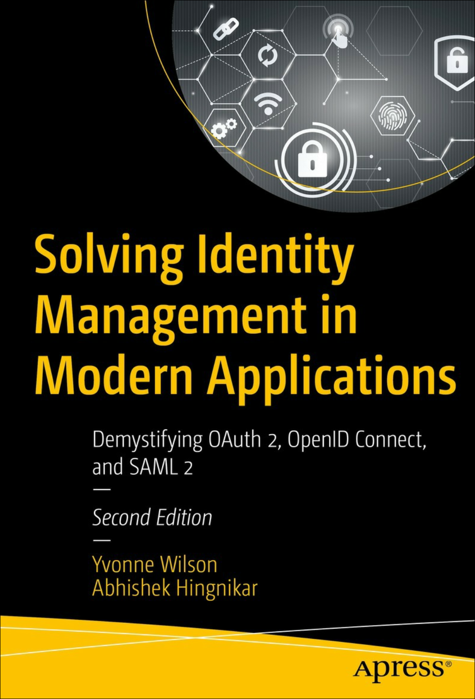

# Solving Identity Management in Modern Applications

Book Resources

  

<!-- omit in toc -->
## Contents

- [1. The Hydra of Modern Identity](#1-the-hydra-of-modern-identity)
  - [Identity Challenges](#identity-challenges)
- [2. The Life of an Identity](#2-the-life-of-an-identity)
  - [Events in the Life of an Identity](#events-in-the-life-of-an-identity)
  - [3. Evolution of Identity](#3-evolution-of-identity)
    - [Identity Management Approaches](#identity-management-approaches)
      - [Per-Application Identity Silo](#per-application-identity-silo)
      - [Centralized User Repository](#centralized-user-repository)
      - [Early SSO Servers](#early-sso-servers)
      - [Federated Identity and SAML 2](#federated-identity-and-saml-2)

## 1. The Hydra of Modern Identity

> Wisdom is not a product of schooling but of the lifelong attempt to acquire it. &mdash; Albert Einstein

Over time, teams maintaining an in-house identity service start to feel like they are fighting a hydra &mdash; the mythical beast from Greek mythology with nine heads. When one of her heads was cut off, two more would grow back in its place. The more you try to fix the problem, the worse it gets.

### Identity Challenges

There isn't a master solution to identity management that fits every case. 

Decisions when developing applications:
- Who are your users? And will they authenticate?
- Level of authentication strength?
- How do you provide simple but secure access?  SSO provides convenience, but can also be a single point of failure.
- Will you be migrating from legacy applications?
- Regulatory requirements?
- User experience when onboarding?

This book covers three popular identity protocols: OAuth 2, OIDC (OpenID Connect), and SAML 2.

## 2. The Life of an Identity

**Terminology:**  
- Identifier: refers to a single attribute whose purpose is to uniquely identify a person or entity, within a specific context.
- Identity: a collection of attributes associated with a specific person or entity in a specific context.

An identity includes one or more identifiers, e.g. name, age, address, IP address, model, version number.

A person may have more than one identity, e.g. a person may have a work identity and a personal identity.

An account is a local construct that is used to perform actions on an identity associated with specific context.

An identity management (idM) system is a set of services that support the creation, modification, and removal of identities and associated accounts, including the authentication and authorization required to access resources.

### Events in the Life of an Identity

### 3. Evolution of Identity

#### Identity Management Approaches

##### Per-Application Identity Silo

Each application implements its own identity repository, authentication, authorization, and access control. This approach is still used in many scenarios where a user signs up for an application-specific username and password.

##### Centralized User Repository

Includes directory services. Enables applications hosted around the world to leverage the same identity information.

Disadvantages:
- Directory does not maintain user session state.
- Each application still had to collect the username and password, exposing the user's password to each application.
- A compromise at one application might put other applications at risk.

##### Early SSO Servers

Early SSO servers leveraged the directory service but provided a layer on top of it to maintain sessions to remember users that had already authenticated.

An application would redirect the user to an SSO server to have the user authenticated there, and the application would receive the authentication results in a secure predetermined fashion.

If a user accessed a second application shortly after they authenticated for the first application, the SSO server would recognize that the user had already authenticated and would not require them to log in again.

Benefits:
- Users were able to log in once and access multiple applications.
- User's password was only sent to one place, the SSO server.
- Single place to implemnt authentication policy and stronger authentication mechanisms.

Drawbacks:
- The interaction between applications and SSO servers was somewhat proprietary, leading to vendor lock-in.
- SSO products were time-consuming to implement and maintain.
- SSO relied on cookies, which due to browser restrictions, meant the solutions worked within one Internet domain.

##### Federated Identity and SAML 2

The explosion of SaaS applications created challenges for managing identities, as users were able to sign up for an account without the IT department's knowledge. 

The SAML 2 (Security Assertion Markup Language) standard, published in 2005, provided a solution for web single sign-on (SSO) across domains and federated identity. 

With SAML 2, SaaS applications could redirect corporate users back to a corporate authentication service, known as an identity provider (IdP), for authentication.

Identity federation provided a way to link an identity used in an application with an identity at the service provider.
