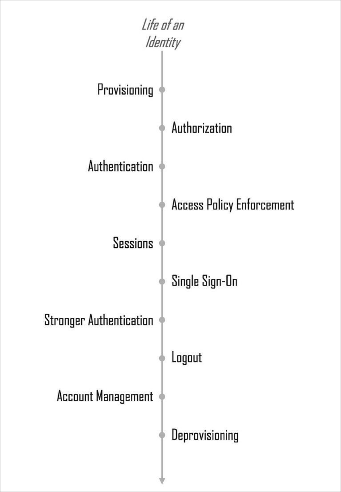

# Solving Identity Management in Modern Applications

Book Resources

  

<!-- omit in toc -->
## Contents

- [1. The Hydra of Modern Identity](#1-the-hydra-of-modern-identity)
  - [Identity Challenges](#identity-challenges)
- [2. The Life of an Identity](#2-the-life-of-an-identity)
  - [Events in the Life of an Identity](#events-in-the-life-of-an-identity)
  - [3. Evolution of Identity](#3-evolution-of-identity)
    - [Identity Management Approaches](#identity-management-approaches)
      - [Per-Application Identity Silo](#per-application-identity-silo)
      - [Centralized User Repository](#centralized-user-repository)
      - [Early SSO Servers](#early-sso-servers)
      - [Federated Identity and SAML 2](#federated-identity-and-saml-2)
      - [WS-Fed](#ws-fed)
      - [OpenID](#openid)
      - [OAuth 2](#oauth-2)
      - [OpenID Connect (OIDC)](#openid-connect-oidc)
      - [OAuth 2.1](#oauth-21)
- [4. Identity Provisioning](#4-identity-provisioning)
  - [Provisioning Options](#provisioning-options)
    - [Self-Registration](#self-registration)
      - [Progressive Profiling](#progressive-profiling)
      - [Invite-Only Registration](#invite-only-registration)
    - [Identity Migration](#identity-migration)
      - [Support Legacy Hashing Algorithm](#support-legacy-hashing-algorithm)
      - [Bulk Identity Migration](#bulk-identity-migration)
      - [Gradual Migration of Users](#gradual-migration-of-users)
    - [Administrative Account Creation](#administrative-account-creation)
      - [Cross-Domain Account Creation](#cross-domain-account-creation)
    - [Leveraging Existing Identity Service](#leveraging-existing-identity-service)
  - [Selecting an Identity Service](#selecting-an-identity-service)
    - [Self-Registered Identities](#self-registered-identities)
    - [Organization Identities](#organization-identities)
    - [Government Identities](#government-identities)
  - [Identity Provider Selection](#identity-provider-selection)
  - [Identity Proofing](#identity-proofing)
  - [Choosing and Validating Identity Attributes](#choosing-and-validating-identity-attributes)
- [5. OAuth 2 and API Authorization](#5-oauth-2-and-api-authorization)
  - [API Authorization](#api-authorization)
  - [OAuth 2](#oauth-2-1)
  - [Terminology](#terminology)
    - [Roles](#roles)
    - [Confidential and Public Clients](#confidential-and-public-clients)
    - [Client Profiles](#client-profiles)
    - [Tokens and Authorization Code](#tokens-and-authorization-code)
  - [How OAuth 2 Works](#how-oauth-2-works)
    - [Authorization Code Grant](#authorization-code-grant)
      - [Authorization Code Grant Type + PKCE](#authorization-code-grant-type--pkce)

## 1. The Hydra of Modern Identity

> Wisdom is not a product of schooling but of the lifelong attempt to acquire it. &mdash; Albert Einstein

Over time, teams maintaining an in-house identity service start to feel like they are fighting a hydra &mdash; the mythical beast from Greek mythology with nine heads. When one of her heads was cut off, two more would grow back in its place. The more you try to fix the problem, the worse it gets.

### Identity Challenges

There isn't a master solution to identity management that fits every case. 

Decisions when developing applications:
- Who are your users? And will they authenticate?
- Level of authentication strength?
- How do you provide simple but secure access?  SSO provides convenience, but can also be a single point of failure.
- Will you be migrating from legacy applications?
- Regulatory requirements?
- User experience when onboarding?

This book covers three popular identity protocols: OAuth 2, OIDC (OpenID Connect), and SAML 2.

## 2. The Life of an Identity

**Terminology:**  
- Identifier: refers to a single attribute whose purpose is to uniquely identify a person or entity, within a specific context.
- Identity: a collection of attributes associated with a specific person or entity in a specific context.

An identity includes one or more identifiers, e.g. name, age, address, IP address, model, version number.

A person may have more than one identity, e.g. a person may have a work identity and a personal identity.

An account is a local construct that is used to perform actions on an identity associated with specific context.

An identity management (idM) system is a set of services that support the creation, modification, and removal of identities and associated accounts, including the authentication and authorization required to access resources.

### Events in the Life of an Identity

The chapters in this book will cover the following events in the life of an identity:

### 3. Evolution of Identity

#### Identity Management Approaches

##### Per-Application Identity Silo

Each application implements its own identity repository, authentication, authorization, and access control. This approach is still used in many scenarios where a user signs up for an application-specific username and password.

##### Centralized User Repository

Includes directory services. Enables applications hosted around the world to leverage the same identity information.

Disadvantages:
- Directory does not maintain user session state.
- Each application still had to collect the username and password, exposing the user's password to each application.
- A compromise at one application might put other applications at risk.

##### Early SSO Servers

Early SSO servers leveraged the directory service but provided a layer on top of it to maintain sessions to remember users that had already authenticated.

An application would redirect the user to an SSO server to have the user authenticated there, and the application would receive the authentication results in a secure predetermined fashion.

If a user accessed a second application shortly after they authenticated for the first application, the SSO server would recognize that the user had already authenticated and would not require them to log in again.

Benefits:
- Users were able to log in once and access multiple applications.
- User's password was only sent to one place, the SSO server.
- Single place to implemnt authentication policy and stronger authentication mechanisms.

Drawbacks:
- The interaction between applications and SSO servers was somewhat proprietary, leading to vendor lock-in.
- SSO products were time-consuming to implement and maintain.
- SSO relied on cookies, which due to browser restrictions, meant the solutions worked within one Internet domain.

##### Federated Identity and SAML 2

The explosion of SaaS applications created challenges for managing identities, as users were able to sign up for an account without the IT department's knowledge. 

The SAML 2 (Security Assertion Markup Language) standard, published in 2005, provided a solution for web single sign-on (SSO) across domains and federated identity. 

With SAML 2, SaaS applications could redirect corporate users back to a corporate authentication service, known as an identity provider (IdP), for authentication.

Identity federation provided a way to link an identity used in an application with an identity at the service provider.

Companies could now have the advantages of single sign-on with both internal and SaaS applications.

However, SAML 2 was no silver bullet. 
- It was complex to configure and implement.
- There was no viable business model to address consumer-facing scenarios, as users were unlikely to pay money for a consumer-facing identity service.
- It only solved the authentication problem, not the authorization problem.

At the time, applications were evolving to architectures based on REST APIs, and SAML 2 was not well suited for this.

##### WS-Fed

The Web Services Federation Language (WS-Fed) was created as part of a larger set of protocols known as WS-* specifications.

The WS-Fed 1.2 specification, published in 2009, provided mechanisms to authorize access to managed resources for identities managed in other realms.

Intially, ADFS only supported WS-Fed. ADFS introduced SAML 2 support in version 2.0, released in 2010.

##### OpenID

With SAML 2 only adopted in employee-facing scenarios, consumers were still forced to register for accounts with each application they used.

A new industry group gave rise to a protocol called OpenID, which included the idea of a user-controlled identity solution for the consumer use case.

The original OpenID protocol was never widely used, but it did highlight the need for user-centric identity solutions and laid the groundwork for OpenID Connect (OIDC).

##### OAuth 2

With the rise of social media, many consumer-facing websites were created that allowed users to upload content such as pictures.

This gave rise to use cases where applications needed to retrieve content on the user's behalf. For example, a person who uploaded photos to a social media site might want to enable another website that printed photos to access their photos at the social media site.

In the absence of a better solution, the user would have to provide their username and password to the photo printing site, which would then use that information to access the social media site.

The OAuth 2 protocol addressed this by allowing a user to authorize a third-party application to access their resources without sharing their credentials.

The OAuth 2 version allows a user to authorize one application, known as a client (the photo printing site), to send a request to an API, known as a resource server (the social media site), on the user's behalf to retrieve data at the resource server owned by the user.

To accommodate this, the application interacts with an authorization server which authenticates a user as part of obtaining their consent for the application to access their resources.

The application receives a token, whcih enables it to call the reosurce server on the user's behalf.

By this time, Google and LinkedIn implemented OAuth 2, enabling consumer-facing applications to use OAuth 2 to access user data at these sites.

There was one problem, though...

OAuth 2 was not designed as a general authentication service and could not securely be used for this purpose, so another solution was needed.

##### OpenID Connect (OIDC)

OpenID Connect (OIDC) was designed to provide a key feature needed for an authentication service: the ability to verify the identity of a user based on the authentication performed by an authorization server.

OIDC was devised as a layer on top of OAuth 2 to provide information in a standard format to applications about the identity of an authenticated user. This provided a solution for applications for user authentication as well as API authorization.

Benefits of OIDC:
- Website developers can delegate the work of implementing authentication and password reset logic to an OIDC provider.
- Users can leverage one account to log in to many sites without exposing their account credentials to other sites.
- Users have fewer usernames and passwords to remember, which reduces the risk of password reuse.
- Providers benefit if OIDC attracts more users to their platform.
- OIDC provides the SSO benefits of SAML 2 and when combined with OAuth 2, it provides a solution for both authentication and authorization.

##### OAuth 2.1

The OAuth 2.0 specification was published in 2012. By 2020, application developers had to read through a lot of OAuth 2-related documents to understand best practices for using OAuth 2 in different scenarios, such as browser-based applications, native mobile applications, and classic web applications.

To address this, the OAuth working group began working on a new specification, OAuth 2.1, which aims to consolidate and simplify the OAuth 2.0 framework by incorporating best practices and removing deprecated features.

## 4. Identity Provisioning

An identity includes at least one identifier, such as a username or email address, and various user profile attributes.

### Provisioning Options

Here are some common approaaches for provisioning identities:
- A user creates a new identity by filling out a self-registration form
- A special case of self-registration is sending select users an invitation to sign up
- User identities are transferred  from a previously existing user repository
- An identity service with an existing repository of user identies is leveraged
- An administrator or automated process creates identities

#### Self-Registration

Requires you to design and create a sign-up form. Form must be able to scale to handle large numbers of users. Self-registration necessitates privacy notices about the information you collect.

| **Advantages**                                                 | **Disadvantages**                                     |
| -------------------------------------------------------------- | ----------------------------------------------------- |
| Ability to collect user attributes that don’t exist elsewhere. | May deter some prospective new users from signing up. |
| Control over user registration experience.                     | Liability associated with storing login credentials.  |
| Scalability through self-service.                              |                                                       |

##### Progressive Profiling

Progressive profiling is a technique where you build up user profile attributes over time, rather than asking for all attributes at once during registration.

Progressive profiling reduces the friction that a lengthy sign-up form would present.

##### Invite-Only Registration

Used for situations where you create an account and assign it privileges before sending the invitation.

| **Advantages**                                               | **Disadvantages**                                           |
|--------------------------------------------------------------|------------------------------------------------------------|
| Ability to collect user attributes not available from other sources. | The work to implement the invitation mechanism and control access to it. |
| Control over user registration experience.                   | The work to issue invitations.                             |
| Some protection against registration by hackers and bots.    | May deter some prospective new users from signing up.      |
| Scalability through self-service if users invite others.     | Liability associated with storing login credentials.       |

#### Identity Migration

While most user profile attributes can be moved, passwords represent a challenge.

Passwords are typically stored in a hashed format. Most systems use salts and iterations counts, which makes it difficult to import passwords from one system to another and have it be usable in the new system.

##### Support Legacy Hashing Algorithm

One solution is to move the hashed passwords to the new system and update the new system to support the legacy hashing algorithm. 

| **Advantages**                                   | **Disadvantages**                                              |
|--------------------------------------------------|----------------------------------------------------------------|
| Avoids need for password reset.                 | Work to implement legacy hashing algorithm(s).                |
| Transfers all accounts in a usable state.       | Liability associated with storing login credentials.          |
|                                                  | Inherits any weakness associated with legacy hashing algorithms. |

##### Bulk Identity Migration

If it's not possible to support the legacy hashed passwords, you can extract the user profile attributes and create new accounts in the new system.

| **Advantages**                                               | **Disadvantages**                                                                                     |
|--------------------------------------------------------------|-------------------------------------------------------------------------------------------------------|
| Transfers all users at once.                                 | Transfers all accounts, even inactive accounts, unless they are filtered out during the transfer.     |
| Enables immediate shutdown of legacy user repository.        | Requires all users to set new passwords via account recovery, unless the new system supports legacy hashed passwords. |
| No latency added at login time to check a legacy system for a user account. | Migrating all users at once may cause an outage or delay the migration if things go wrong and there is no backup plan. |
| Code to transfer identities can be independent of application code. | If multiple applications use the legacy repository, they must migrate at the same time if the legacy repository is to be shut off after migration. |
|                                                              | Liability associated with storing login credentials.                                                  |

##### Gradual Migration of Users

| **Advantages**                                                                 | **Disadvantages**                                                                                     |
|-------------------------------------------------------------------------------|-------------------------------------------------------------------------------------------------------|
| Inactive accounts can be weeded out.                                          | Requires that legacy identity store is accessible from new application’s authentication mechanism.    |
| No password reset required (for users who log in during migration).           | Legacy identity store must remain accessible until enough identities are transferred.                 |
| Spreads out risk of outages by migrating identities gradually (no big bang risk). | Transfer mechanism must be maintained throughout the gradual migration.                              |
| Can support continued use of previous sign-up mechanisms or applications that use the legacy identity repository during the gradual migration. | A user’s first login after migration starts may have some latency as identity data is transferred from the legacy system. |
|                                                                               | Potential for user confusion after password reset if other applications continue to use the legacy data store. |
|                                                                               | Potential for user confusion if users can make user profile updates in both legacy and new systems after migration. |
|                                                                               | Implementation work cannot be easily decoupled from the application team.                            |
|                                                                               | Liability associated with storing login credentials.                                                 |

#### Administrative Account Creation

The approaches include:
- Manual account creation
- Automated account creation
- Cross-domain acocunt creation

##### Cross-Domain Account Creation

Applicable sceanarios:
- Maintaining employee accounts in external SaaS applications
- Maintaining partner accounts in corporate identity repositories or applications
- Maintaining business customer user accounts in business-facing applications
- Maintaining guest professor or student accounts in educational institutions
- Maintaining guest user accounts in public sector applications

The industry-standard protocol, SCIM 2.0 (System for Cross-domain Identity Management), can be used to facilitate cross-domain account creation and management.

SCIM 2.0 was defined in 2015 to provide a more standard approach to sending an5updating identify information from one domain to another.

SCIM 2.0 is a RESTful API that uses JSON to represent user profile attributes and supports the creation, modification, and deletion of user accounts.

SCIM also provides an optional common user schema, though mapping profile attributes between systems is usually required.

| **Advantages**                                                                 | **Disadvantages**                                                                                     |
|-------------------------------------------------------------------------------|-------------------------------------------------------------------------------------------------------|
| User doesn’t fill out registration form.                                      | Time-consuming if not automated.                                                                     |
| Administrator can assign customized privileges for the account.               | Requires care to ensure that only the user knows the password for the account created.               |
| Can incorporate manual identity validation step if required by the organization creating the account. | Liability associated with storing login credentials if stored locally.                               |
| Can be automated via workflow or identity provisioning software.              |                                                                                                       |
#### Leveraging Existing Identity Service

Popular with social providers. Involves less work for users.

It is important to vet an external identity service before trusting it.

| **Advantages**                                                                 | **Disadvantages**                                                                                     |
|-------------------------------------------------------------------------------|-------------------------------------------------------------------------------------------------------|
| Better user experience if it reduces the data required to sign up.            | You may have to collect additional profile information not available from the identity provider service. |
| Easier for user to remember password if identity provider account is used frequently. | You need to evaluate the service and availability levels of the external identity service to ensure it meets your needs. |
| You may not have to implement a login form or account recovery mechanism if all users authenticate via the identity provider service. | May require additional development or configuration work for each identity provider service to be used. |
| Less risk if you do not store user passwords.                                 | May require configuration work at each identity provider service for each application you have, unless you use an authentication broker service. |
|                                                                               | May require collaborative troubleshooting with another organization when issues occur.                 |

### Selecting an Identity Service

Characteristics of strong vs weak identities:

| **Strong Identities**                                                         | **Weak Identities**                                                             |
|-------------------------------------------------------------------------------|---------------------------------------------------------------------------------|
| Linked to a real person, who can be held accountable for actions taken with the identity and associated accounts. | Anonymous, cannot be linked to a real person.                                   |
| Identity attributes are validated during account issuance process.            | Little validation of identity attributes.                                       |
| Issued by entity recognized as authoritative for a particular context.        | Issued by an entity with little recognized authority.                           |
| Contains mechanisms to protect against forgery or unauthorized use.           | Few protections against forgery or unauthorized use.                            |

#### Self-Registered Identities

A self-registered identity, such as Gmail, is an example of a weak identity. You can sign up for these accounts using any identifier that is not already taken, e.g. santa.claus@yahoo.com.

You do not have to supply true information in the sign-up form, and the service provider does not validate most of the identity data.

#### Organization Identities

Many of these identities meet the criteria for strong identities, as they are issued by an organization that is recognized as authoritative in a particular context.

#### Government Identities

Are an example of strong identities, as they are issued by a government entity that is recognized as authoritative in a particular context.

### Identity Provider Selection

There are many vendors that offer cloud-based identity services, such as Google Apps, Azure AD, Auth0, Amazon Cognito, Okta, and Ping Identity.

Identity provider scenarios:

| **Scenario**               | **Common Type(s) of Identity Provider**                                                                 |
|-----------------------------|-------------------------------------------------------------------------------------------------------|
| **B2C: Business to consumer** | Social Identity Providers Identity services such as Azure AD or Auth0 Application-specific repository |
| **B2E: Business to employee** | Identity services such as Google Apps, Azure AD, Auth0 Any OIDC or SAML 2–compliant identity provider |
| **B2B: Business to business** | Identity services such as Google Apps, Azure AD, Auth0 Any OIDC or SAML 2–compliant provider controlled by the business customer |

### Identity Proofing

In the US, the Patriot Act requires that financial institutions verify the identity of their customers before opening an account. This is known as identity proofing.

Providers, such as ID.me, Sumsub, Socure, and Trulioo, are examples of venddors that help validate identities of self-registered users.

### Choosing and Validating Identity Attributes

Advantages and disadvantages of account identifiers

| **Advantages**                                                                 | **Disadvantages**                                                                                     |
|-------------------------------------------------------------------------------|-------------------------------------------------------------------------------------------------------|
| **Email:** Globally unique. No need to hunt for a name that isn’t taken already. May be easier to remember than a username. Can double as a communication attribute, such as for password resets. | **Email:** May need to be changed by a user. May be reassigned by an email provider to a new user. May be reassigned by a corporate provider to a new user. Terminated by the employer if a user leaves. Not all companies issue email addresses. Children may not have email addresses. Family members may share an email address. May expose personal information (user's name). Exposure as display name may result in spam email. |
| **Username:** Easier to set up multiple accounts at a site. May be shorter to type on mobile devices. Can be used in searches, allowing other attributes with personal data to be encrypted. | **Username:** Only unique within an application domain. Merging user repositories problematic after acquisitions. May be harder for a user to remember which username was used at each site. A user may want to change a username over time. May expose personal information if used for display and it contains personal information. |
| **Phone number:** Globally unique (with country code). No need to hunt for a free identifier. Can double as a communication attribute, such as for password resets. May be easier for a user to remember than a username. | **Phone number:** Exposure as display name may cause spam calls. Might be reassigned to a new user over time. May involve a charge to obtain a phone number. More difficult for a person to set up multiple accounts at the same site. May be changed by a user for various reasons. May be terminated by a phone provider. |

## 5. OAuth 2 and API Authorization

### API Authorization

An application may need to call an API on behalf of a user to access content owned by the user. Or it may call the API on its own behalf if teh application owns the desired content.

### OAuth 2

OAuth stands for "Open Authorization". The protocol was designed as an open standard, hence the "O".

With OAuth 2, an application can obtain a user's consent to call an API on their behalf, without needing the user's credentials for the API site. An application cals also obtain authorization to call an API on its own behalf if it owns the content to be accessed.

Prior to OAuth 2, the application needed the user's credentials to act on behalf of the user, putting the user's credentials at risk:

With OAuth 2, an authorization server handles access requests for an API and returns a security token that can be used by the application to access the API.

### Terminology

#### Roles

OAuth defines four roles in an authoriztion request:

1. Resource Server &mdash; A service (with an API) storing protected resources to be accessed by an application.
2. Resource Owner &mdash; A user or other entity that owns protected resources at the resource server
3. Client &mdash; An application which needs to access resources at the resource server, on the resource owner's behalf or on its own behalf.
4. Authorization Server &mdash; A service trusted by the resource server to authorize applications to call the resource server. It authenticates the application or resource owner and requests consent. With OAuth 2, the resource server (API) is a relying party to the authorization server. The authorization server and resource server may be operated by the same entity.

#### Confidential and Public Clients

OAuth 2 defines two client types:

1. Confidential Client &mdash; An application that can secure store confidential secrets with which to authenticate itself to an authorization server. Confidential clients typically execute primarily on a protected server.
2. Public Client &mdash; An application that can neither securely store a secret or credentials to authenticate itself to an authorization server. Public clients typically execute on the user's client device or in the client browser.

#### Client Profiles

OAuth 2 defines three profiles for client applications based on application topologies:

1. Web Application &mdash; A confidential client with code executing on a protected, back-end server. The server can securely store any secrets needed for the client to authenticate itself as well as any tokens it receives from the authorization server. Such credentials are not exposed to the resource owner.

2. Browser-Based Application &mdash; Assumed to be a public client with code executing in the user's browser. Examples: A JavaScript-based single-page application (SPA) running in the browser. Such an application is assumed to be incapable of adequately securing credentials with which to authenticate itself to the authorization server.

3. Native Application &mdash; Assumed to be a public client that is installed and executed on the user's device, such as a mobile appliction or desktop application.

In practice, these definitions may overlap because a web application may serve up HTML pages that contain some JavaScript, and single-page applications may have a small back end.

#### Tokens and Authorization Code

OAuth 2 defines two security tokens and an intermediate authorization code:

1. Authorization Code &mdash; An intermediary, opaque code returned to an application to obtain an access token and optionally a refresh token. Each authorization code is used once.

2. Access Token &mdash; A token used by an application to access an API. It represents the application's authorization to call an API and has an expiration.

3. Refresh Token &mdash; An optional token that can be used by an application to request a new access token when a prior access token has expired.

### How OAuth 2 Works

The OAuth 2 Authorization Framework defines different methods by which an application interacts with an authorization server to obtain authorization to call an API. Each method uses a credential, known as authorization grants, to obtain an access token.

There are three main types of authorization grants:
- Authorization code
- Client credentials
- Refresh token

There were two additional grant types that were removed in OAuth 2.1:
- Implicit grant
- Resource owner password credentidals
 
An additional grant type has been designed for devices which have limited capabilities for user interaction, i.e. scenarios for IoT; however, this grant type has not made it into the specification yet:
- Client device

#### Authorization Code Grant

The authorization code grant uses two requests from the application to the authorization server to obtain an access token.

First, the user's browser is redirected to the authorization server’s endpoint to approve an API call on their behalf. This redirect lets the server authenticate the user and get their consent. Once consent is given, the server sends the browser back to the application with an **authorization code**.

Next, the application uses the authorization code to make a back-channel request to the authorization server’s token endpoint. The server then issues an access token, which the application can use to call the API.

The authorization code grant type was designed for confidential clients. It allows a secure application backend, which can safely store an authentication secret, to verify its identity with the authorization server when exchanging an authorization code for an access token.

It also means the response with the access token can be delivered to the application back end, which will make subsequent API calls. 

A side benefit is that tokens are returned via secure back-channel response. However, while originally optimized for confidential clients, the addition of PKCE enables other client types to use this grant type as well.

##### Authorization Code Grant Type + PKCE
